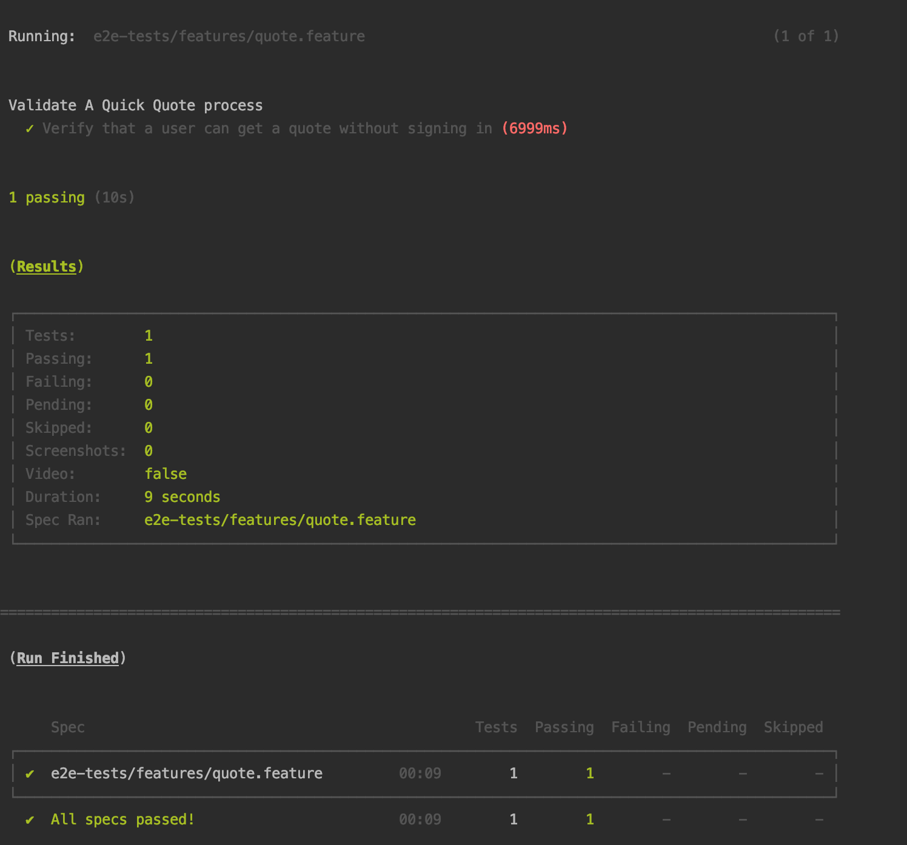

# A SIMPLE CYPRESS CUCUMBER AUTOMATION FOR E2E TESTS: QUICK QUOTE

# CYPRESS AUTOMATION

One happy path E2E Scenario run 

### BUILD
- Navigate to e2e folder
- `npm install`

### To Run
Note that to change the default url please override "baseUrl" in cypress.json

- `npm run cy:run-chrome`  - run test in chrome interactive mode
- `npm run cy:run-firefox`  - run test in fireFox interactive mode
- `npm run cy:run-electron`  - run test in electron interactive mode
- `npm run cy:run`  - run test headless for CI

> 

